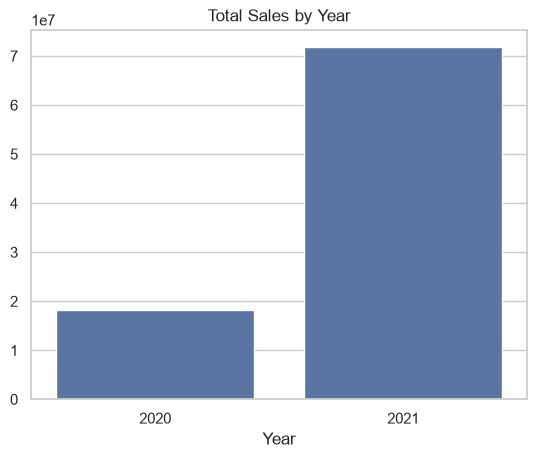
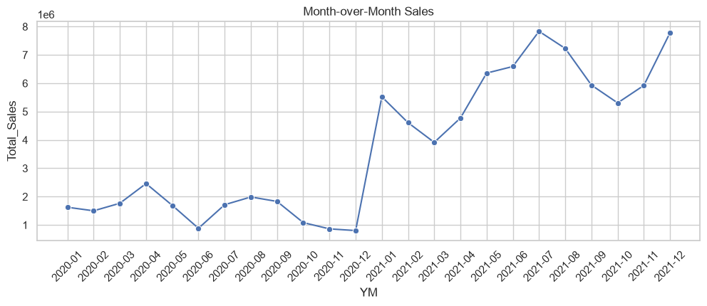
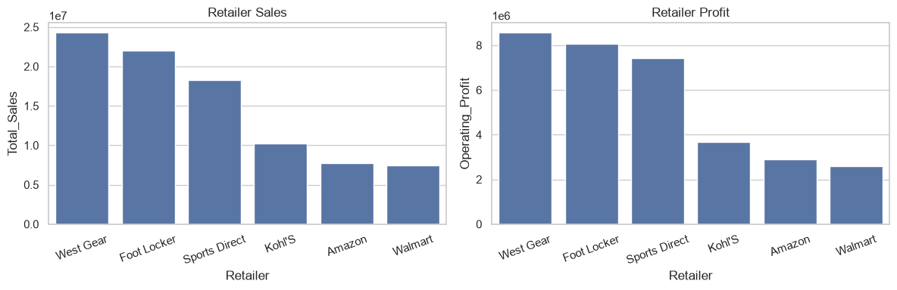
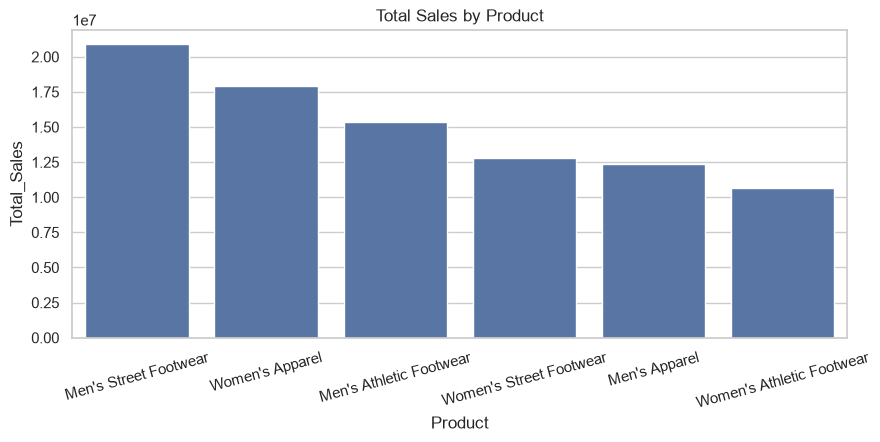
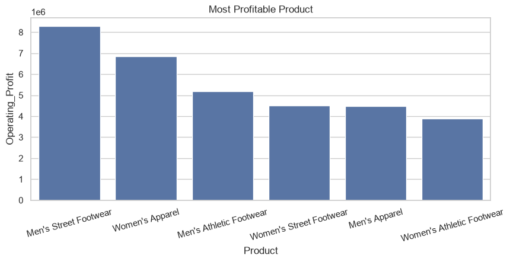
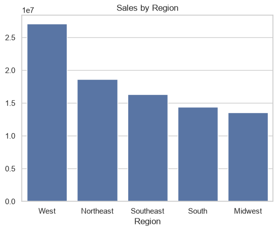
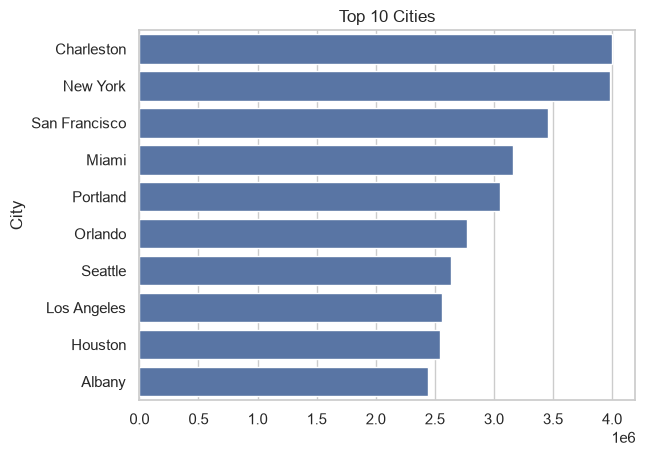

# Retail Sales Data Analysis with Pandas + Visualization

End-to-end analysis of US retail sales (2020-2021) using Python and Pandas to answer 15 business questions about sales, time trends, retailers, products, and geography.

## Dataset

- Raw: `data.csv` (9,661 rows x 12 cols)
- Cleaned: `Data Analysis.csv` (9,644 rows after cleaning)
- Final columns: `Product, Price_Per_Unit, Region, Units_Sold, Total_Sales, Year, Month, Day, Retailer, Operating_Profit, City`
- Retailers: Foot Locker, West Gear, Sports Direct, Kohl's, Amazon, Walmart
- Products: Men's / Women's Street Footwear, Athletic Footwear, Apparel
- Regions: West, Northeast, Midwest, South, Southeast

## Data Cleaning

- Standardized columns: `strip + Title + replace(' ', '_')`
- Fixed typos: `amazon -> Amazon`, `foot locker -> Foot Locker`, `houston -> Houston`, `Men's aparel -> Men's Apparel`
- Dropped `Retailer ID`, filled 7 missing `Region` with mode
- Converted `Invoice_Date` to datetime, extracted `Year, Month, Day`
- Cleaned `$` and `,` from `Price_Per_Unit, Units_Sold, Total_Sales, Operating_Profit` and converted to numeric
- Recalculated `Price_Per_Unit = Total_Sales / Units_Sold`
- Dropped 4 zero-sales rows and 13 duplicates, no nulls left

## Business Questions Answered

Sales: total sales, avg by region/product, product counts, top/bottom product (Q1-Q6)
Time: units per year, sales per year, month-over-month (Q7-Q9)
Retailer: best by sales and profit (Q10-Q11)
Product: most profitable, avg price (Q12-Q13)
Geography: best region, best city (Q14-Q15)

## Key Findings

- Total Sales: ~89.9M (2020: 18.2M, 2021: 71.7M)
- Units Sold: 2020: 462,349 / 2021: 2,016,512
- Best Retailer by Sales: West Gear (24.29M), then Foot Locker (22.00M)
- Best Retailer by Profit: West Gear (8.56M)
- Most Profitable Product: Men's Street Footwear (8.28M)
- Lowest by Total Sales: Women's Athletic Footwear (10.66M)
- Best Region: West (27.07M)
- Best City: Charleston (3.99M), then New York (3.98M)
- Avg Price: Women's Apparel highest (~25), Women's Street lowest (~19.3)

## Visualizations

Built with Matplotlib + Seaborn. Each chart maps to its question number.

### Total Sales by Year (Q8)


### Month-over-Month Trend (Q9)


### Retailer Sales and Profit (Q10, Q11)


### Product Sales and Profit (Q5, Q6, Q12)



### Region Sales (Q14)


### Top 10 Cities (Q15)


## Project Structure

```text
Project/
├── project.ipynb
├── data.csv
├── Data Analysis.csv
├── README.md
├── sales_by_year.png
├── sales_monthly.png
├── retailer.png
├── product_sales.png
├── product_profit.png
├── region.png
└── cities.png
```

## How to Run

```bash
pip install pandas matplotlib seaborn jupyterlab
jupyter lab
```

Then open `project.ipynb` -> Run All. Or quick check:

```python
import pandas as pd
df = pd.read_csv('Data Analysis.csv')
print(df['Total_Sales'].sum())
print(df.groupby('Retailer')['Total_Sales'].sum().sort_values(ascending=False))
```

## Tools

Python, Pandas, Matplotlib, Seaborn, Jupyter Notebook
